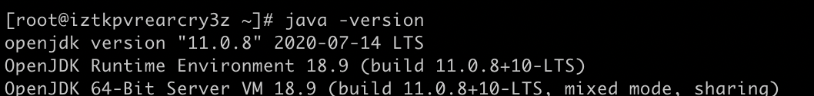

# Elasticsearch安装

查看依赖环境



下载安装

```
curl -L -O https://artifacts.elastic.co/downloads/elasticsearch/elasticsearch-6.2.4.tar.gz
```

下载成功后解压

`tar -xvf elasticsearch-6.2.4.tar.gz -C /opt`

尝试运行

切换到安装路径

```
cd /opt/elasticsearch-6.2.4/bin

./elasticsearch
```

出现各种问题及相应解决方案：

运行失败报错信息集合：

出现警告：

> OpenJDK 64-Bit Server VM warning: Option UseConcMarkSweepGC was deprecated in version 9.0 and will likely be removed in a future release. 

解决方法：

修改jvm.options 文件配置， 将-XX:+UseConcMarkSweepGC 改为 -XX:+UseG1GC  后重启。

出现错误：

> Exception in thread "main" SettingsException[Failed to load settings from [elasticsearch.yml]]; nested: ElasticsearchParseException[malformed, expected settings to start with 'object', instead was [VALUE_STRING]];

解决方法：

这个错误是由于修改elasticsearch.yml配置参数错误。很可能是冒号前后没加空格，导致无法正常解析yml文件。脑残问题很坑。

出现错误：

> can not run elasticsearch as root

解决方法:

由于elasticsearch内部机制对于权限控制严格，不允许使用root用户开启。需要切换启动用户（su  "用户名"）。

```
su suxin  #切换用户
sudo chown -R suxin elasticsearch-6.2.4/  #授权
./elasticsearch #再次尝试运行
```


出现错误：

/Library/Java/JavaVirtualMachines/jdk1.8.0_271.jdk

