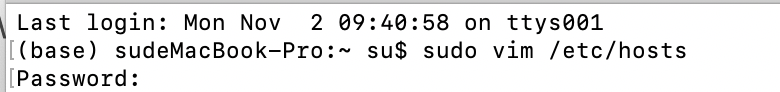
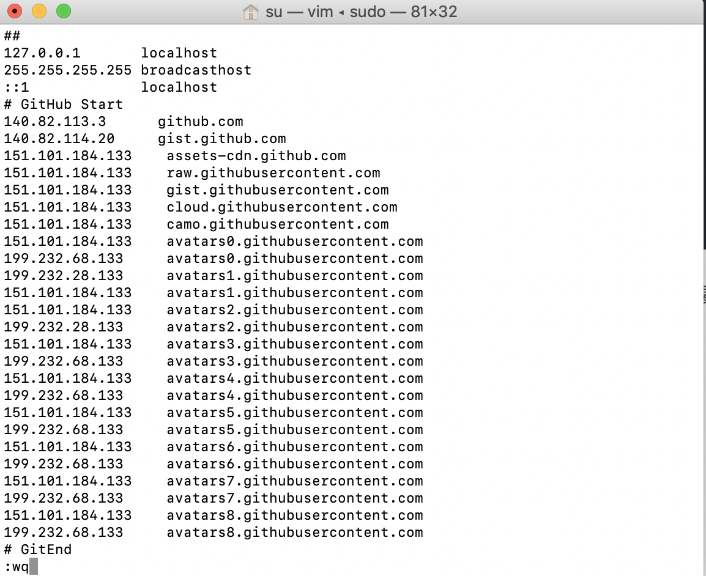
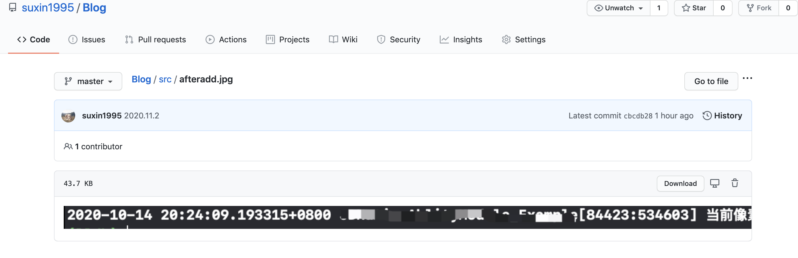

# Github图片资源显示失败解决方案

#### 问题

​	在使用GitHub期间，总能遇到网页无法正常显示图片资源，包括但不局限于README、个人头像、图像资源等裂开无法正常加载，体验极差。

​	打开开发者工具显示当前网页状态。发现出现大量加载资源错误：

> Failed to load resource: net::ERR_CERT_COMMON_NAME_INVALID

​	由于使用了错误域名访问节点的https资源从而导致该错误。错误原因可能是：

> - dns污染
> - host设置错误
> - 官方更新dns，但dns缓存没有及时更新，导致出现错误解析

#### 解决方案	

​	考虑修改使用本地hosts文件对github进行域名解析，直接使用IP地址指向资源路径。

​	1.  Mac 环境下打开hosts文件:

​	2.  修改hosts 文件，末尾添加如下地址：

> \# GitHub Start 
>
> 140.82.113.3   github.com
>
> 140.82.114.20   gist.github.com
>
> 151.101.184.133  assets-cdn.github.com
>
> 151.101.184.133  raw.githubusercontent.com
>
> 151.101.184.133  gist.githubusercontent.com
>
> 151.101.184.133  cloud.githubusercontent.com
>
> 151.101.184.133  camo.githubusercontent.com
>
> 151.101.184.133  avatars0.githubusercontent.com
>
> 199.232.68.133   avatars0.githubusercontent.com
>
> 199.232.28.133   avatars1.githubusercontent.com
>
> 151.101.184.133  avatars1.githubusercontent.com
>
> 151.101.184.133  avatars2.githubusercontent.com
>
> 199.232.28.133   avatars2.githubusercontent.com
>
> 151.101.184.133  avatars3.githubusercontent.com
>
> 199.232.68.133   avatars3.githubusercontent.com
>
> 151.101.184.133  avatars4.githubusercontent.com
>
> 199.232.68.133   avatars4.githubusercontent.com
>
> 151.101.184.133  avatars5.githubusercontent.com
>
> 199.232.68.133   avatars5.githubusercontent.com
>
> 151.101.184.133  avatars6.githubusercontent.com
>
> 199.232.68.133   avatars6.githubusercontent.com
>
> 151.101.184.133  avatars7.githubusercontent.com
>
> 199.232.68.133   avatars7.githubusercontent.com
>
> 151.101.184.133  avatars8.githubusercontent.com
>
> 199.232.68.133   avatars8.githubusercontent.com
>
>  
>
> \# GitHub End

​	3.  保存退出

​	

成功修改后，再次刷新页面可以看到问题已经解决。图片资源可以正常显示。

