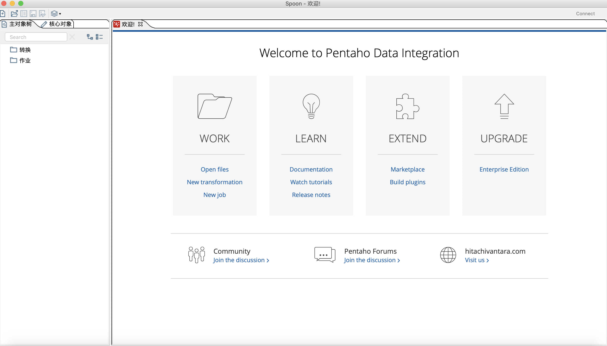

# Kettle Mac环境启动闪退解决方案


### 背景

​	Kettle 是基于Java 的企业级ETL工具。可简化数据仓库创建更新与维护。

​	同事Windows环境下简单双击Spoon.bat 即可打开图形化界面，可我在Mac OS 下运行尝试打开图形化界面总会出现闪退情况。

>  当前环境背景:
>
> - java:15  
> - kettle: pdi-ce-8.2.0.0-342

### 解决

​	根据运行log与调研，怀疑该版本Kettle不兼容高版本java。重新官网下载java8，修改依赖环境。

> 命令
>
> ​    vim ~/.bash_profile
>
> ​	export JAVA_HOME=/Library/Java/JavaVirtualMachines/jdk1.8.0_271.jdk/Contents/Home
>
> ​	source ~/.bash_profile		

​	重新运行Kettle  `sh spoon.sh` 问题却仍没解决。

​	不懈google下终于在 [issues](https://jira.pentaho.com/browse/PDI-18866)中发现线索。除了java大版本限制在java8以外，就连小版本迭代也会对依赖环境造成影响。（坑爹啊 摔！）提问者在Java Envirment openjdk version "1.8.0_252"  中无法正常使用。报错信息：

> ```
> 2020/07/09 12:31:22 - Spoon - at org.pentaho.commons.launcher.Launcher.main(Launcher.java:92)
> java.lang.NullPointerException
> at org.eclipse.swt.widgets.Control.internal_new_GC(Unknown Source)
> at org.eclipse.swt.graphics.GC.<init>(Unknown Source)
> at org.eclipse.swt.graphics.GC.<init>(Unknown Source)
> at org.eclipse.swt.custom.CTabFolder.updateTabHeight(Unknown Source)
> at org.eclipse.swt.custom.CTabFolder.runUpdate(Unknown Source)
> at org.eclipse.swt.custom.CTabItem.getBounds(Unknown Source)
> at org.eclipse.swt.custom.CTabFolder.onPaint(Unknown Source)
> at org.eclipse.swt.custom.CTabFolder$1.handleEvent(Unknown Source)
> at org.eclipse.swt.widgets.EventTable.sendEvent(Unknown Source)
> at org.eclipse.swt.widgets.Display.sendEvent(Unknown Source)
> at org.eclipse.swt.widgets.Widget.sendEvent(Unknown Source)
> at org.eclipse.swt.widgets.Widget.sendEvent(Unknown Source)
> at org.eclipse.swt.widgets.Widget.sendEvent(Unknown Source)
> at org.eclipse.swt.widgets.Control.drawWidget(Unknown Source)
> at org.eclipse.swt.widgets.Widget.drawRect(Unknown Source)
> at org.eclipse.swt.widgets.Display.windowProc(Unknown Source)
> at org.eclipse.swt.internal.cocoa.OS.objc_msgSendSuper(Native Method)
> at org.eclipse.swt.widgets.Display.applicationNextEventMatchingMask(Unknown Source)
> at org.eclipse.swt.widgets.Display.applicationProc(Unknown Source)
> at org.eclipse.swt.internal.cocoa.OS.objc_msgSend(Native Method)
> at org.eclipse.swt.internal.cocoa.NSApplication.nextEventMatchingMask(Unknown Source)
> at org.eclipse.swt.widgets.Display.readAndDispatch(Unknown Source)
> at org.pentaho.di.ui.spoon.Spoon.readAndDispatch(Spoon.java:1385)
> at org.pentaho.di.ui.spoon.Spoon.waitForDispose(Spoon.java:7968)
> at org.pentaho.di.ui.spoon.Spoon.start(Spoon.java:9350)
> at org.pentaho.di.ui.spoon.Spoon.main(Spoon.java:711)
> at sun.reflect.NativeMethodAccessorImpl.invoke0(Native Method)
> at sun.reflect.NativeMethodAccessorImpl.invoke(NativeMethodAccessorImpl.java:62)
> at sun.reflect.DelegatingMethodAccessorImpl.invoke(DelegatingMethodAccessorImpl.java:43)
> at java.lang.reflect.Method.invoke(Method.java:498)
> at org.pentaho.commons.launcher.Launcher.main(Launcher.java:92)
> 2020/07/09 12:31:23 - Spoon - Spoon  已经结束.
> stopping
> ```

在开发者建议下切换成"1.8.0_242“解决该问题。

所以索性尝试在Oracle 下载历史版本 1.8.0_202 。[下载地址](https://www.oracle.com/java/technologies/javase/javase8-archive-downloads.html)

同样重新配置JAVA_HOME环境变量。

等待数秒后终于看到成功界面。