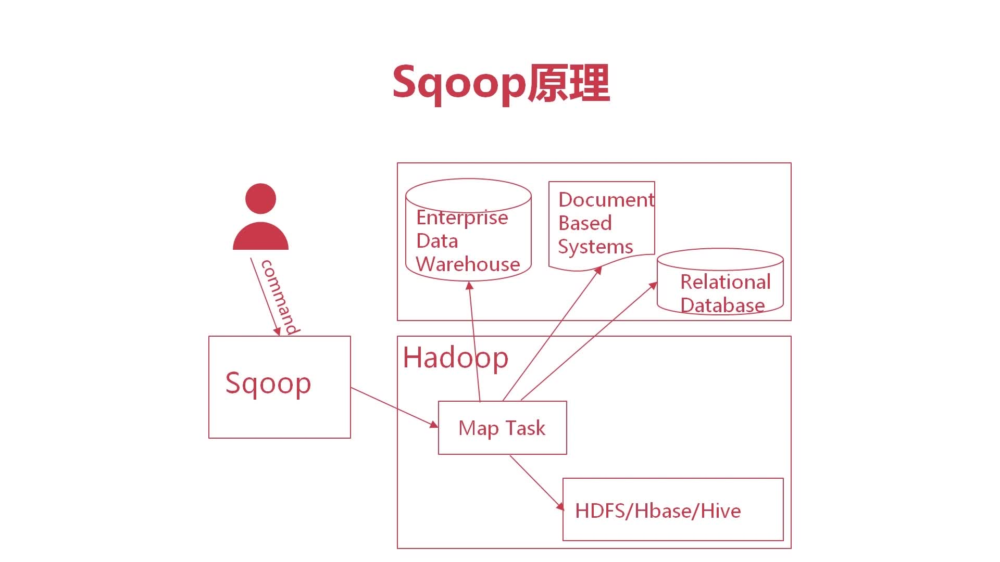

​	

​		Sqoop 作为Hadoop生态圈的第三方模块，用于关系型数据库与Hadoop平台数据传输，可将结构化数据类型与文件类型相互转化。

##### Sqoop import原理

​		Sqoop接收到提交的导入命令，与数据库Server通信，获取数据库表的元数据信息；

内部将相关命令转换成map reduce 代码，生成只有Map的Mapreduce 作业并提交至hadoop。hadoop内部将其

​	

