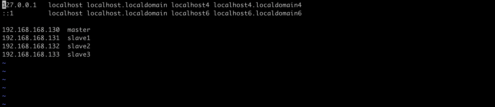
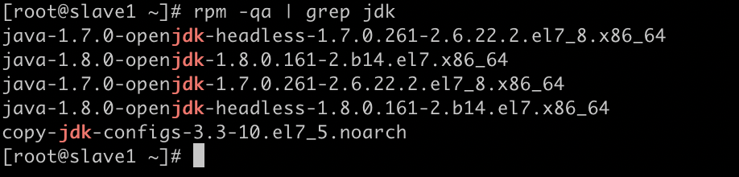
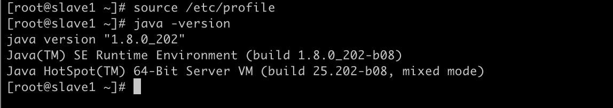

# mac 搭建Hadoop集群（一）

前置环境：

​	本地构建多台虚拟机节点 或 存在多台服务器开放ssh 22端口

### 配置集群节点免密通信

##### 修改主机名

```shell
vi /etc/hostname
```

​	部署规划，选择一台主节点与多台子节点。分别修改主机名为master、slave1、slave2	

```shell
sysctl kernel.hostname=$(cat /etc/hostname)
```

​	执行上述命令，使主机不用重启hostname 即可生效（需重开shell窗口）

##### 修改host

```shell
vi /etc/hosts
```

​	在该文件中标注各节点ip 与 hostname映射关系



​	并将该配置文件发送给所有节点

```shell
scp -r /etc/hosts root@slave1:/etc/
scp -r /etc/hosts root@slave2:/etc/
scp -r /etc/hosts root@slave3:/etc/
```

​	测试修改结果

```shell
ping slave1
ping slave2
ping slave3
```

##### 设置SSH免密登陆

```shell
ssh-keygen -t rsa
ssh-copy-id master
ssh-copy-id slave1
ssh-copy-id slave2
ssh-copy-id slave3
```

​	在各节点执行上述步骤。生成密钥并将其发送给其他节点。

​	测试登陆结果：

```shell
ssh master
ssh slave1
ssh slave2
ssh slave3
```


### 配置必要java环境

##### 删除已有jdk

````shell
rpm -qa | grep jdk
````

​	查看当前环境是否安装openjdk  卸载不干净jdk 防止版本冲突



​	卸载已安装jdk与jdk-configs

````shell
yum remove *openjdk*
yum remove copy-jdk-configs-3.3-10.el7_5.noarch
````

##### 上传解压jdk

​	当前使用版本：jdk1.8.0-202	

​	上传当前合适JDK安装包到/opt目录下 并解压。

````
tar xzvf jdk-8u202-linux-x64.tar.gz
````

##### 设置环境路径

​	设置JAVA_HOME：

````shell
vi /etc/profile
````

​	并在文本中编辑模式下添加路径：

````shell
export JAVA_HOME=/opt/jdk1.8.0_202
export PATH=$PATH:$JAVA_HOME/bin:$JAVA_HOME/sbin
````

​	:wq 退出保存后重启该文件使其生效:  source  /etc/profile

##### 节点同步

​	最后，将上述操作同步到其他节点。同样的删除openjdk，然后将master节点上已经解压的jdk复制发送到子节点上：

````shell
scp -r /opt/jdk1.8.0_202 root@slave1:/opt/
scp -r /opt/jdk1.8.0_202 root@slave2:/opt/
scp -r /opt/jdk1.8.0_202 root@slave3:/opt/
````

​	同样将profile文件复制发送到其他节点覆盖，避免重复修改

```shell
scp /etc/profile root@slave1:/etc/
scp /etc/profile root@slave2:/etc/
scp /etc/profile root@slave3:/etc/
```

​	最后，每个节点分别执行source /etc/profile 使其生效。通过java -version 测试是否配置成功：

