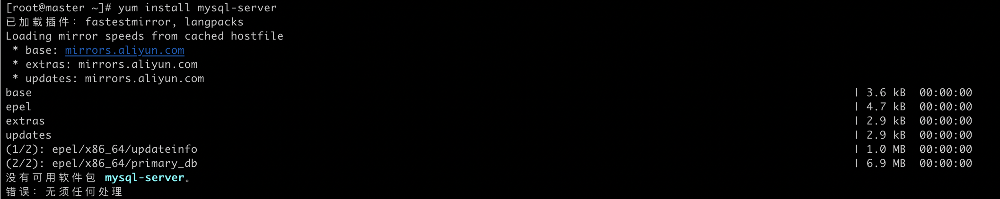
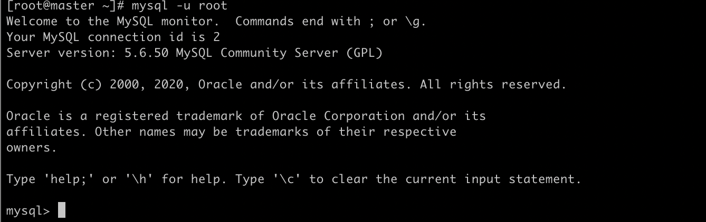
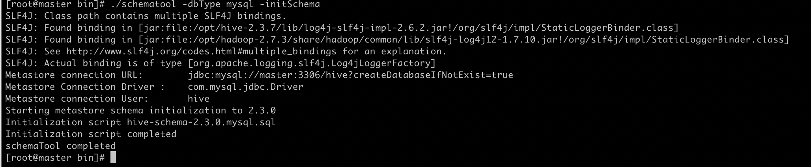
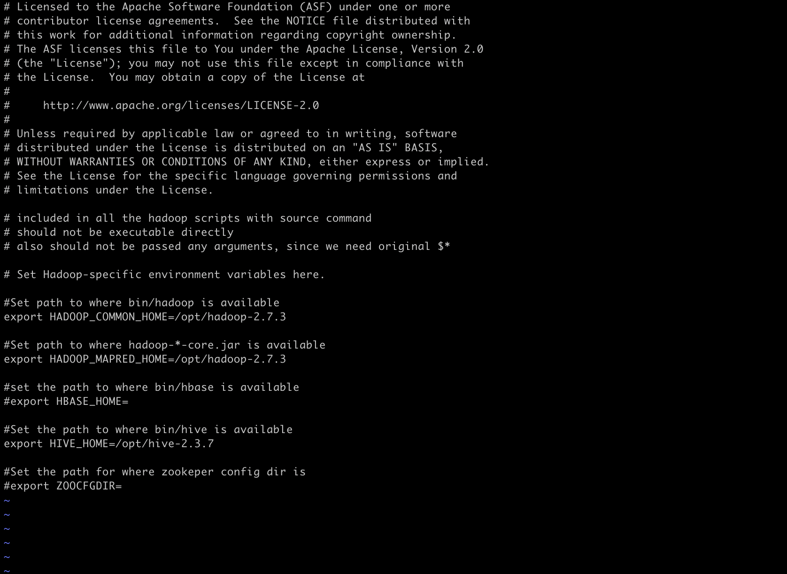
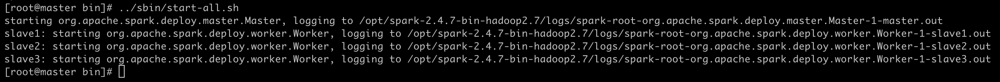

# mac 搭建Hadoop+Hive集群	(二)

前置环境：

​	已在前文配置完成多台可免密登陆相互通信的集群机器

### Hadoop安装

##### 上传并解压

​	当前使用版本：hadoop-2.7.3

​	cd 到资源路径解压：

```shell
tar zxvf hadoop-2.7.3.tar.gz
```

 	解压完成后进入路径  hadoop-2.7.3/etc/hadoop

##### 修改配置文件

1. 修改core-site.xml

   ````xml
   <!-- 指定HDFS中NameNode的地址 --> 
        <property>
        <name>fs.defaultFS</name>
            <value>hdfs://master:9000</value>
        </property>
   <!-- 指定hadoop运行时产生文件的存储目录 --> <property> 
        <name>hadoop.tmp.dir</name>
        <value>/opt/hadoop-2.7.3/tmp</value>
        </property>
   ````

2. 修改hdfs-site.xml

   ````xml
   <configuration>
   <!-- 设置dfs副本数，不设置默认是3个 --> 
       <property>
           <name>dfs.replication</name>
           <value>2</value>
   		</property>
   <!-- 设置namenode的端口 -->
     	<property>
       		<name>dfs.namenode.http-address</name>
       		<value>master:50070</value>
     	</property>
   <!-- 设置secondname的端口 --> 
       <property> 
       		<name>dfs.namenode.secondary.http-address</name>
           <value>slave1:50090</value>
       </property>
   </configuration>
   ````

3. 修改mapred-site.xml

   若文件夹中仅存在mapred-site.xml.template  则需要生成该文件

   > mv mapred-site.xml.template mapred-site.xml

   ````xml
   <configuration>
       <!-- 通知框架MR使用YARN -->
       <property>
           <name>mapreduce.framework.name</name>
           <value>yarn</value>
       </property>
   </configuration>
   ````

4. 修改yarn-site.xml

   ````xml
   <configuration>
   <!-- reducer获取数据的方式 --> 
     	<property> 
      				<name>yarn.nodemanager.aux-services</name>
             <value>mapreduce_shuffle</value>
       </property>
   <!-- 指定YARN的ResourceManager的地址 --> 
   		<property> 
             <name>yarn.resourcemanager.hostname</name>
             <value>master</value>
       </property>
   </configuration>
   ````

5. 修改Hadoop-env.sh

   在文本末端增加jdk 路径

   > JAVA_HOME=/opt/jdk1.8.0_202

6. 修改slaves

   在文件中标注可用节点

   ​	

7. 修改环境配置文件

   > vi /etc/profile

   在profile文件中配置Hadoop、jdk路径

   ````shell
   export JAVA_HOME=/opt/jdk1.8.0_202
   export PATH=$PATH:$JAVA_HOME/bin:$JAVA_HOME/sbin
   
   export HADOOP_HOME=/opt/hadoop-2.7.3
   export PATH=$PATH:$HADOOP_HOME/bin:$HADOOP_HOME/sbin
   ````

##### 节点传送

​	复制传送文件

```shell
#复制jdk
scp -r /opt/jdk1.8.0_202 slave1:/opt/
scp -r /opt/jdk1.8.0_181 slave2:/opt/

#复制设置文件
scp /etc/profile slave1:/etc/
scp /etc/profile slave2:/etc/

#复制hadoop
scp -r /opt/hadoop-2.7.3/ root@slave1:/opt
scp -r /opt/hadoop-2.7.3/ root@slave2:/opt
```

​	在每个节点分别执行 使profile 生效 

> Source /etc/profile


##### 格式化集群

​		若集群第一次启动，需要格式化namenode

````shell
hdfs namenode -format
````

​		看到INFO common.Storage: Storage directory /opt/hadoop-2.7.3/tmp/dfs/name has been successfully formatted. 成功格式化即可。


##### 启动集群

````shell
[root@mac hadoop-2.7.3]# start-all.sh
````

​		 执行启动命令，开启hadoop集群。

##### 查看进程

​		开启成功后，可在各节点通过 jps 命令查看各节点状态。

##### 访问管理页面

​		各节点运行正常后，可访问web页面 8088、50070端口查看job状态 

##### 参考文档

参考博客链接1[🔗](https://www.cnblogs.com/taojietaoge/p/10803537.html)

参考博客链接2[🔗](https://www.linuxidc.com/Linux/2017-03/142051.htm)


### 安装依赖元数据库环境

​	安装Hive需要本地配置元数据库环境。本文选用Mysql 作为远程元数据库，部署在master节点上。

```shell
yum install mysql
yum install mysql-devel
yum install mysql-server
```

​	发现安装mysql和mysql-devel都成功，但是安装mysql-server失败，报错如下：



​	这是由于本机环境linux CentOS 7 版本将MySQL数据库软件从默认的程序列表中移除，用mariadb代替了。使用如下解决方法：

```shell
wget http://dev.mysql.com/get/mysql-community-release-el7-5.noarch.rpm
rpm -ivh mysql-community-release-el7-5.noarch.rpm
yum install mysql-community-server
```

​	下载完成后重启数据库服务

```shell
service mysqld restart
```

​	初次进入mysql，root账户没有密码



​	设置root用户密码

```shell
mysql> set password for 'root'@'localhost' =password('password');
Query OK, 0 rows affected (0.00 sec)
```

​	为root用户开放所有库表权限

```shell
mysql> grant all privileges on *.* to root@'%'identified by 'password';
```

​	创建 hive 数据库

```sql
mysql> create database hive;
```

​	验证配置，进入成功

> [root@master ~]# mysql -u root -p
> Enter password:


### Hive安装

​	当前使用版本：hive-2.3.7

​	cd 到资源路径解压，并将解压文件改名为hive-2.3.7

```shell
tar -zxfv apache-hive-2.3.7-bin.tar.gz
mv apache-hive-2.3.7-bin hive-2.3.7
```

##### 修改配置文件	

​	1.配置环境变量：

```shell
vi /etc/profile

# hive
export HIVE_HOME=/opt/hive-2.3.7
export PATH=$HIVE_HOME/bin:$PATH
export HIVE_CONF_DIR=$HIVE_HOME/conf
export CLASSPATH=$CLASSPATH:$HIVE_HOME/lib
```

​	cd  /opt/hive-2.3.7/conf

​	2.修改hive-env.sh 配置：

```shell
cp hive-env.sh.template hive-env.sh 
vi hive-env.sh

HADOOP_HOME=/opt/hadoop-2.7.3
export HIVE_CONF_DIR=/opt/hive-2.3.7/conf
export HIVE_AUX_JARS_PATH=/opt/hive-2.3.7/lib
```

​	3.修改hive-site.xml 配置：

```shell
cp hive-default.xml.template hive-site.xml
vi hive-site.xml
```

```xml
#全局搜索修改以下四个属性
<property>
    <name>javax.jdo.option.ConnectionURL</name>
    <value>jdbc:mysql://master:3306/hive?createDatabaseIfNotExist=true</value>
    <description>JDBC connect string for a JDBC metastore</description>
</property>
<property>
    <name>javax.jdo.option.ConnectionDriverName</name>
    <value>com.mysql.jdbc.Driver</value>
    <description>Driver class name for a JDBC metastore</description>
</property>
<property>
    <name>javax.jdo.option.ConnectionUserName</name>
  	#元数据库username
    <value>root</value>
    <description>username to use against metastore database</description>
</property>
<property>
    <name>javax.jdo.option.ConnectionPassword</name>
  	#元数据库password
    <value>*******</value>
    <description>password to use against metastore database</description>
</property>
<!--配置缓存目录-->
<property>
    <name>hive.exec.local.scratchdir</name>
    <value>/opt/hive-2.3.7/iotmp</value>
    <description>Local scratch space for Hive jobs</description>
</property>
<property>
    <name>hive.downloaded.resources.dir</name>
    <value>/opt/hive-2.3.7/iotmp</value>
    <description>Temporary local directory for added resources in the remote file system.</description>
</property>

```

​	4.修改 bin/hive-config.sh

```shell
export JAVA_HOME=/opt/jdk1.8.0_202
export HIVE_HOME=/opt/hive-2.3.7
export HADOOP_HOME=/opt/hadoop-2.7.3
```

##### 导入元数据库连接jar包	

​	上传mysql-connector-java-5.1.48-bin.jar 包，并将其移动到hive-2.3.7/bin 目录下

```shell
mv mysql-connector-java-5.1.48 hive-2.3.7/lib/
```

##### 分发节点

```shell
scp -r /opt/hive-2.3.7  root@slave1:/opt/
scp -r /opt/hive-2.3.7  root@slave2:/opt/
scp -r /opt/hive-2.3.7  root@slave3:/opt/
```

##### 子节点修改配置	

​	分别在各子节点修改

```xaml
vi /opt/hive-2.3.7/conf/hive-site.xml

<property>  
    <name>hive.metastore.uris</name>  
    <value>thrift://master:9083</value>
    <description>Thrift URI for the remote metastore. Used by metastore client to connect to remote metastore.</description>  
</property>
```

#####	初始化元数据库

```shell
vi /opt/hive-2.3.7/bin

./schematool -dbType mysql -initSchema
```

​	得到成功反馈



##### 启动metastore服务

```shell
hive –service metastore &
```


​	在 master 节点上运行 jps 应该会有RunJar 进程

​	最后在主节点及子节点运行hive验证

##### 参考文档

​	Hive文档参考链接[🔗](https://my.oschina.net/lvqihua/blog/3037015)


### 配置Sqoop环境

##### 上传并解压

​	当前使用版本：sqoop-1.4.7.bin__hadoop-2.6.0.tar.gz

​	cd 到资源路径解压：

```shell
tar zxvf sqoop-1.4.7.bin__hadoop-2.6.0.tar.gz
```

##### 修改配置文件

​	cd 到解压文件路径  cd  sqoop-1.4.7.bin__hadoop-2.6.0/conf

​	1. 编辑sqoop-env.sh 文件

```shell
cp sqoop-env-template.sh sqoop-env.sh
vi sqoop-env.sh

export HADOOP_COMMON_HOME=/opt/hadoop-2.7.3
export HADOOP_MAPRED_HOME=/opt/hadoop-2.7.3
export HIVE_HOME=/opt/hive-2.3.7-bin
```



​	2. 验证安装

```shell
cd  sqoop-1.4.7.bin__hadoop-2.6.0/bin

./sqoop version
```

##### 连接postgresql数据库

​	将下载的postgresql 的jdbc驱动包 以及hive/lib文件夹下 hive-common-2.3.7.jar包置放在sqoop/lib 下

​	连接远端数据库并操作：

​	查看数据库

```shell
./sqoop list-databases --connect jdbc:postgresql://localhost:5432 --username test --password test
```

​	查看数据表

```shell
./sqoop list-tables --connect jdbc:postgresql://localhost:5432/test --username test --password test
```

​	从pq向hive导入数据

```shell
./sqoop import --connect jdbc:postgresql://localhost:5432/test「库名」 --username test「数据库用户」 --password test「数据库密码」 --table product_storage「表名」 --hive-import --hive-overwrite --hive-database=test「hive库名」 --m 3「作业节点数」 -- --schema ods_v2「指定schema」
```


# 配置spark环境

前置环境：

​	已在前文配置hadoop集群服务并启用

##### 解压资源

```shell
tar xvzf spark-2.4.7-bin-hadoop2.7.tgz
tar xvzf scala-2.11.12.tgz
```

##### 设置环境变量

```shell
#scala
export SCALA_HOME=/opt/scala-2.11.12
export PATH=$SCALA_HOME/bin:$PATH

#spark
export SPARK_HOME=/opt/spark-2.4.7-bin-hadoop2.7
export PATH=$SPARK_HOME/bin:$PATH
```

##### 修改配置文件

```shell
cd /opt/spark-2.4.7-bin-hadoop2.7/conf

cp spark-env.sh.template spark-env.sh
cp slaves.template	slaves

```

​	配置子节点 

> vi slaves
>
> #输入子节点host
>
> slave1
>
> slave2
>
> slave3

​	增加环境路径

```shell
vi spark-env.sh

export JAVA_HOME=/opt/jdk1.8.0_202
export SPARK_DIST_CLASSPATH=$(/opt/hadoop-2.7.3/bin/hadoop classpath)
export HADOOP_CONF_DIR=/opt/hadoop-2.7.3/etc/hadoop
export HADOOP_HOME=/opt/hadoop-2.7.3/

export SPARK_MASTER_HOST=master
export SPARK_MASTER_IP=master
export SPARK_WORKER_MEMORY=6g #子节点分配使用内存

export SPARK_WORKER_CORES=3 #子节点数
export SCALA_HOME=/opt/scala-2.11.12
```

##### 适配hive

​	为了将hive平滑过渡到spark sql，使spark可读取来自hive表数据源进行计算。

​	为spark配置hive的信息：

​		1.将hive/conf目录下的hive-site.xml文件拷贝到spark/conf目录下，且修改参数“hive.metastore.schema.verification”的值为“false”。避免进入spark客户端报版本不匹配错误。

​		2.将hive/lib中的mysql-connector-java驱动包拷贝到spark/jars中		

##### 启动集群

​	启动spark集群，使用start-all.sh命令。可在子节点通过jps查看，节点是否响应。



##### 启动spark-sql

​	进入spark/bin下启动spark-sql ，查询执行sql

```shell
spark-sql --master local[2] --jars jar/mysql-connector-java-5.1.48-bin.jar

spark-sql> 
```

​	

