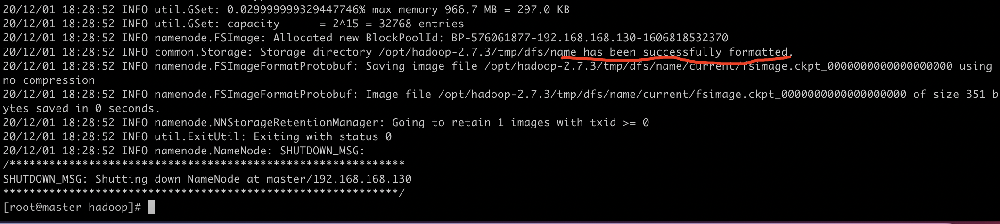

# mac 搭建本地Hadoop集群	(二)

本地环境：

- jdk-8u181-linux-x64.tar.gz
- Royal TSX  下载链接[🔗](https://www.royalapps.com/ts/mac/download)
- Hadoop 3.3.0 下载链接[🔗](http://mirror.bit.edu.cn/apache/hadoop/common/hadoop-3.3.0/) 

​	

jdk-8u181-linux-x64.tar.gz和hadoop-2.7.6.tar.gz 


配置三台可免密登陆相互通信的集群机器后，上传解压hadoop-2.7.3 版本

> tar -zxvf hadoop-2.7.3.tar.gz

  解压完成后进入路径  hadoop-2.7.3/etc/hadoop

1. 修改core-site.xml

   ````xml
   <!-- 指定HDFS中NameNode的地址 --> 
        <property>
        <name>fs.defaultFS</name>
            <value>hdfs://master:9000</value>
        </property>
   <!-- 指定hadoop运行时产生文件的存储目录 --> <property> 
        <name>hadoop.tmp.dir</name>
        <value>/opt/hadoop-2.7.3/tmp</value>
        </property>
   ````

   

2. 修改hdfs-site.xml

   ````xml
   <configuration>
   <!-- 设置dfs副本数，不设置默认是3个 --> 
       <property>
           <name>dfs.replication</name>
           <value>2</value>
   		</property>
   <!-- 设置namenode的端口 -->
     	<property>
       		<name>dfs.namenode.http-address</name>
       		<value>master:50070</value>
     	</property>
   <!-- 设置secondname的端口 --> 
       <property> 
       		<name>dfs.namenode.secondary.http-address</name>
           <value>slave1:50090</value>
       </property>
   </configuration>
   ````

3. 修改mapred-site.xml

   若文件夹中仅存在mapred-site.xml.template  则需要生成该文件

   > mv mapred-site.xml.template mapred-site.xml

   ````xml
   <configuration>
       <!-- 通知框架MR使用YARN -->
       <property>
           <name>mapreduce.framework.name</name>
           <value>yarn</value>
       </property>
   </configuration>
   ````

4. 修改yarn-site.xml

   ````xml
   <configuration>
   <!-- reducer获取数据的方式 --> 
     	<property> 
      				<name>yarn.nodemanager.aux-services</name>
             <value>mapreduce_shuffle</value>
       </property>
   <!-- 指定YARN的ResourceManager的地址 --> 
   		<property> 
             <name>yarn.resourcemanager.hostname</name>
             <value>master</value>
       </property>
   </configuration>
   ````

5. 修改Hadoop-env.sh

   在文本末端增加jdk 路径

   > JAVA_HOME=/opt/jdk1.8.0_202

6. 修改slaves

   在文件中标注可用节点

   ​	

7. 修改环境配置文件

   > vi /etc/profile

   在profile文件中配置Hadoop、jdk路径

   ````shell
   export JAVA_HOME=/opt/jdk1.8.0_202
   export PATH=$PATH:$JAVA_HOME/bin:$JAVA_HOME/sbin
   
   export HADOOP_HOME=/opt/hadoop-2.7.3
   export PATH=$PATH:$HADOOP_HOME/bin:$HADOOP_HOME/sbin
   ````

8. 复制传送文件

   ```shell
   #复制jdk
   scp -r /opt/jdk1.8.0_202 slave1:/opt/
   scp -r /opt/jdk1.8.0_181 slave2:/opt/
   
   #复制设置文件
   scp /etc/profile slave1:/etc/
   scp /etc/profile slave2:/etc/

   #复制hadoop
scp -r /opt/hadoop-2.7.3/ root@slave1:/opt
   scp -r /opt/hadoop-2.7.3/ root@slave2:/opt

   
   ```
   
   在每个节点分别执行
   
   > Source /etc/profile
   
   使profile 生效 


### 启动验证集群

​		

##### 格式化集群

​		若集群第一次启动，需要格式化namenode

````shell
hdfs namenode -format
````

​		看到INFO common.Storage: Storage directory /opt/hadoop-2.7.3/tmp/dfs/name has been successfully formatted. 成功格式化即可。



##### 启动集群

````shell
[root@mac hadoop-2.7.3]# start-all.sh
````

​		 执行启动命令，开启hadoop集群。

##### 查看进程

​		开启成功后，可在各节点通过 jps 命令查看各节点状态。

##### 访问管理页面

​		各节点运行正常后，可访问web页面 8088、50070端口查看job状态 


参考博客链接1[🔗](https://www.cnblogs.com/taojietaoge/p/10803537.html)

参考博客链接2[🔗](https://www.linuxidc.com/Linux/2017-03/142051.htm)

### 安装Hive 环境


