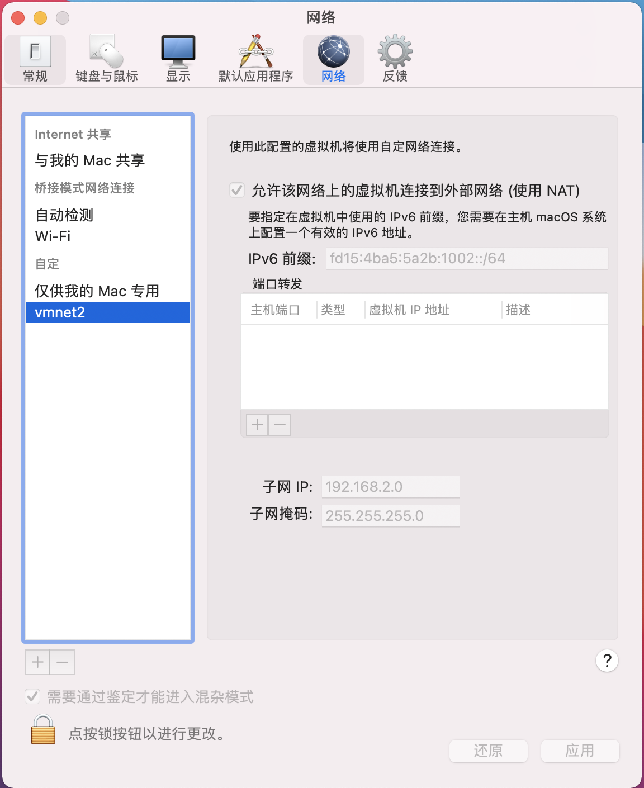
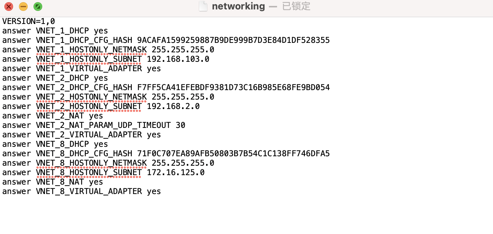
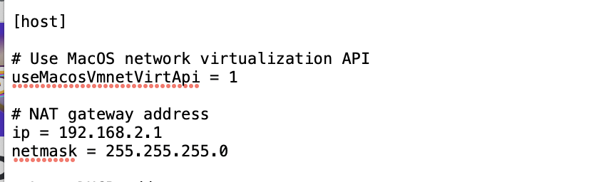

​	最近在调研Flink流处理的相关解决方案效率，想将其作为套件服务嵌入Hadoop生态圈中使用。寻找多台服务器分布测试显然不现实，因此在本地模拟生产环境构建多个虚拟机，依次搭建Hadoop集群。

- 当前环境:
  -  macOS Big Sur 

- 使用工具：
  - VMware Fusion 12  下载链接[🔗](https://www.macwk.com/soft/vmware-fusion)     
  -  Royal TSX  下载链接[🔗](https://www.royalapps.com/ts/mac/download)
  - Hadoop 3.3.0 下载链接[🔗](http://mirror.bit.edu.cn/apache/hadoop/common/hadoop-3.3.0/) 

 ## 配置虚拟机网络

​		使用vmware 构建三台虚拟机作为集群节点，系统一致为centos7 。选取其中之一作为master，另外两个节点作为slave。vmware构建虚拟机的使用教程在此不表。点击左上角

> vmware Fusion > 偏好设置 > 网络

1. 点击解锁🔓  + 增加自定义网络类型
2. 勾选 ’允许该网络上的虚拟机连接到外部网络‘
3. 填写自定义子网IP
4. 点击应用

结果如图所示：

本地终端查看虚拟机网络设置：

> vim /Library/Preferences/VMware\ Fusion/networking

显示如图：

其中 VNET_2 类型就是刚才自定义的网络类型。打开对应文件夹 

> vim /Library/Preferences/VMware\ Fusion/vmnet2/nat.conf

如图所示host 名目下的ip 即网关地址，netmask 即 子网络掩码

查看当前网络dns

  依赖环境搭建

https://www.cnblogs.com/taojietaoge/p/10803537.html

https://www.linuxidc.com/Linux/2017-03/142051.htm

