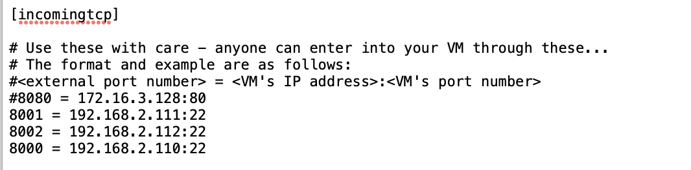

# mac 环境下使用VMware fusion 搭建虚拟机外网映射

​	上节使用VMware fusion 配置网络，成功将本地虚拟机与外网通信。NAT模式相当于形成一个虚拟局域网VLAN。虽然此时可以对外通信，但nat对外隐藏了内网，当使用外网环境去触达本地虚拟机会失败。此时可需要配置外网映射解决问题。

​	本地Mac环境下：

> cd /Library/Preferences/VMware Fusion/vmnet2

​	其中，vmnet2是虚拟机采用的自定义nat类型网络。通常使用默认vmnet8类型。

​	查看文件夹下对应nat.conf配置文件

> vi nat.conf

​	找到incomingtcp节点如图所示：

​	

​	该处用于配置外网映射。

​	格式：本地准备映射出去的端口 = vm虚拟机ip：vm虚拟机端口

​	例如：上节我为三台虚拟机分别配置固定ip为192.168.2.111、192.168.2.112、192.168.2.110  对应ssh端口号22。当前采取一批未被占用端口作映射端口依次为8001、8002、8003。最后构成配置 8001 = 192.168.2.111:22

​	保存退出，重启虚拟机。

​	终端查看当前mac本机IP为172.17.15.12。故外网环境下可通过命令直连本地虚拟机：

> ssh -p 8001 root@172.17.15.12

​	输入密码后成功连接。

