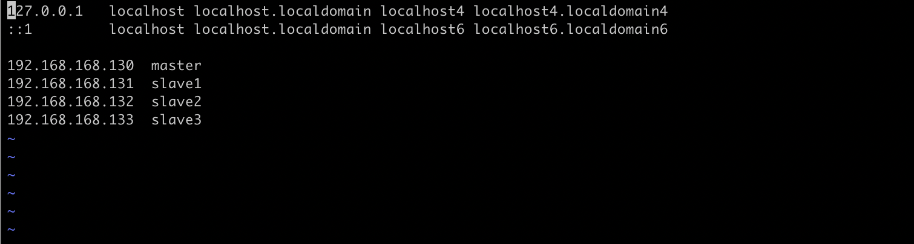
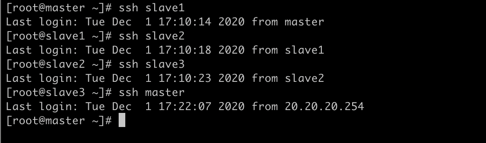

##### 修改主机名

​	修改集群所有节点名称

> vi  /etc/hostname

​	使用后主机名并未立即生效，需要重启系统方能生效。执行命令

	> sysctl kernel.hostname=$(cat /etc/hostname)

​	关闭窗口重新打开shell窗口即可生效


##### 修改host

> vi  /etc/hosts



​	添加集群所有节点的host映射 并将修改后的配置文件发送到所有节点

````shell
scp -r /etc/hosts root@slave1:/etc/
scp -r /etc/hosts root@slave2:/etc/
scp -r /etc/hosts root@slave3:/etc/
````


##### 设置节点间免密登陆

````shell
ssh-keygen -t rsa
````

​	输入该命令 按下四次回车 生成登陆ssh密钥

​	之后将密钥发送给其他所有节点

 ````shell
ssh-copy-id master
ssh-copy-id slave1
ssh-copy-id slave2
ssh-copy-id slave3
 ````

​	其他所有节点重复执行上述过程


##### 测试登陆

​	最后 选择节点进行免密登陆测试



